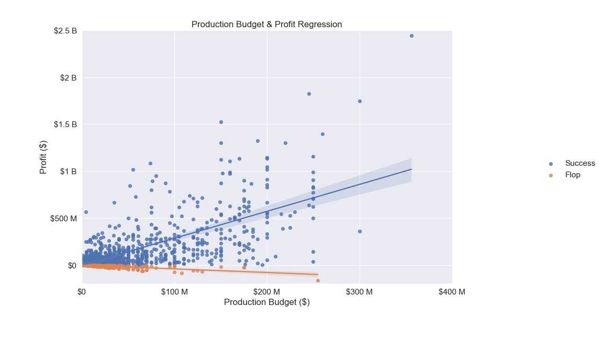
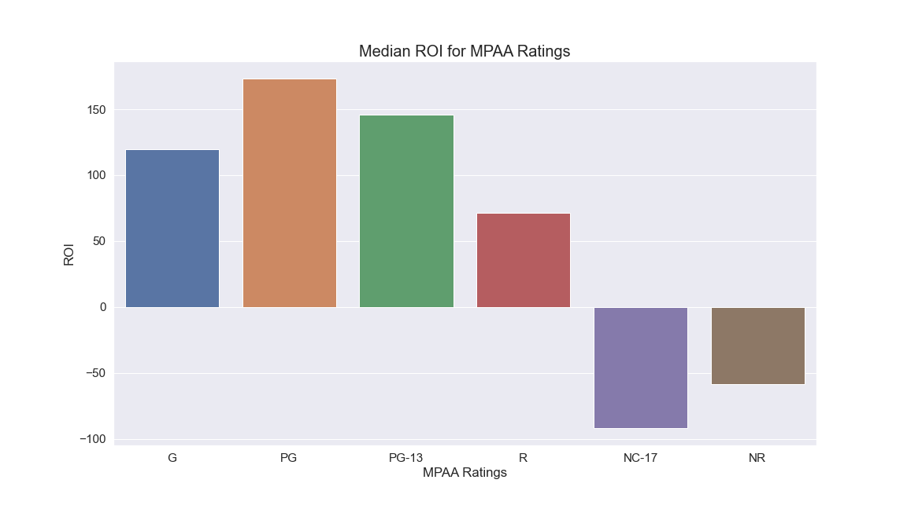

# Box Office Analysis

**Author**: [Johnny Dryman](mailto:johnnydryman@gmail.com)

## Overview

This project analyzes theatrical films with intention of guiding Microsoft through the launch of its new film studio. The results of these analyses will yield actionable insights that Microsoft's new studio head can use to determine what types of films to develop.

## Business Problem


Releasing movies is a daunting endeavor. Not only will it require millions, if not hundreds of millions of dollars to fund wide theatrical releases, it will also require a deep understanding of what today's audiences are willing to watch. Before sending films into production, we need to know what genre of film people are willing to see how we can ensure that audiences have an opportunity to see the film.

## Data

Without years of experience in the industry, our best bet will be to take a look at a large yet targeted sample of theatrical releases.  There are many websites dedicated to box office and film data.  For this project, we will source our data using The Movie Databse's API.

TMDB offers a sound and comprehensive dataset that will be a good foundation for our initial research.  The site has detailed information on over 500,000 theatrical releases throughout history.  While it would be interesting to analyze every film in the database, it would be more apt to target our research in the direction of films that Microsoft is likely to produce.

This project assumes a few things:
- Microsoft is a for profit organization and will be interested in making movies that have a broad market appeal.
- At the beginning of this venture, be focused exclusively on wide releases, and will not enter films into the festival circuit.
- While it is generally preferable to release movies that are highly acclaimed, Microsoft will use historical production budget and box office revenue to indicate success.  In other words, we believe that movie goers will vote on what they like with their wallets.

## Methods

This project uses publically available data form The Movie Database (TMDB).  Trends have been analyzed using descriptive analysis, which provides a useful framework for understanding the modern box office landscape.

## Results

The vast majority of movies recoup their investment at the box office, but not all are successful.



Historically, studios tend to invest more heavily depending on the genre.  Adventure, family, fantasy, and science fiction generally receive the most investment.  War and western movies tend to lose money at the box office despite having budgets that are similar to other low budget genres.


MPAA ratings have a significant impact on ROI.  This is likely caused by the suggested age restriction on PG-13 rated movies and more noticeably with the often enforced age restriction of R rated movies and legal restriction on NC-17 movies.



# Conclusions

This analysis yielded three recommendations for Microsoft's first productions:

* **Budget and revenue are correlated, but this does not suggest Microsoft should spend frivolously.**  Our data set is representative of studios and film makers that are guided by profit and have many decades of experience.  Considering Microsoft is new to the business, caution should be taken to avoid box office failures.  
* **For the strongest returns, Microsoft should focus on the Adventure, Animation, Family, Fantasy, and Science Fiction genres.**  Elements of action and comedy can also be considered.  Horror, Music, Mystery, Romance, and Thriller genres have attractive ROI's, but these genres should only be approached with lower budgets in mind.  War and Western movies should be avoided.
* **Microsoft should script movies with the family audience in mind.**  'Edgy' elements can be considered, but a PG-13 rating will have a noticeable impact on ROI.  R ratings should only be considered with lower budget movies, and NC-17 and NR films should be avoided entirely.

# Next Steps

Further analysis could reveal more nuanced insights to help Microsoft in their film venture:

* **What are the commonalities in box office flops?**  Comparing a dataset of unsuccessful films against a dataset with successful films could help solidify or further clarify the findings in this analysis.

* **Deeper examination of individual movie genres.**  Knowing now which genres have the strongest returns, creating a dataset with just Adventure, Family, etc. could reveal trends within those genres.  These can be used to instruct what to pursue and what to avoid.

* **Elementary analysis of franchise films, popularity, production companies, and runtime.**  Given more time, it could be fruitful to analyze these categories in the dataset from this project.

* **Incorporate and compare TMDB dataset against datasets from other sources.**  It would be helpful to solidify our box office revenue and budget data.  We found that some pieces of data in the TMDB dataset conflicted with other sources.  Financing an IMDB API license could yield higher quality data since TMDB data is sourced by users.  Finally, Rotten Tomatoes API should be implemented to understand the relationship between review scores and box office returns.

## For More Information

See the full analysis in the [Jupyter Notebook](./box_office_analysis.ipynb) or review this [presentation](./Box_Office_Analysis_Presentation.pdf).

For additional info, contact Johnny Dryman at [johnnydryman@gmail.com](mailto:johnnydryman@gmail.com)


## Repository Structure

```
├── data
├── images
├── README.md
├── Box_Office_Analysis_Presentation.pdf
└── box_office_analysis.ipynb.ipynb
```